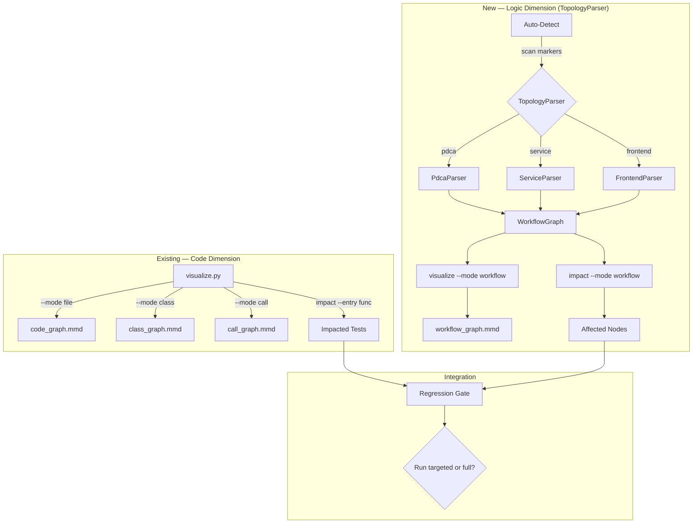
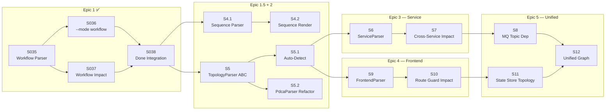

# Product Requirements Document: Workflow Dependency Graph
- **Version**: 1.1
- **Date**: 2026-03-24

---

## 1. Product Overview

### 1.1 Vision
> 在代码维度的调用链（function→function）之上，增加逻辑维度的依赖图（workflow→service→artifact），让 impact analysis 覆盖从函数修改到流程断裂的完整影响链。

### 1.2 Problem Statement
工程规模增长后，修改代码产生的 bug 往往不在函数调用链上，而在更高层的工作流依赖上。例如：修改了 `pactkit-board` skill 的 `archive` 函数 → `/project-done` 命令的 Phase 3.5 会断 → `/project-sprint` 的 Close 阶段会失败。现有 `call_graph.mmd` 只覆盖 Python 函数级，看不到 command→agent→skill→file 的逻辑链路。

映射到微服务场景：修改了 Order Service 的 `createOrder` API → Payment Service 的支付流程受影响 → Notification Service 的通知也断。现有工具只分析单服务内的函数调用链，无法追踪跨服务的 API/MQ 依赖。

映射到前端场景：修改了 `useAuth` hook → 所有依赖 auth 状态的页面受影响 → 路由守卫、SSR 预加载都可能断。前端的 page→component→hook→store 依赖链、路由配置、状态管理拓扑同样需要逻辑维度的可视化。

### 1.3 Target Users
- **Primary**: PactKit 用户（AI Agent 工程师）— 需要理解 PDCA 命令间的依赖关系，防止修改一个 skill 导致多个命令流程断裂
- **Secondary**: 微服务架构团队 — 需要服务间依赖图来做跨服务 impact analysis 和 regression targeting
- **Tertiary**: 前端架构师 — 需要 page→component→hook→store 拓扑图来追踪 UI 变更影响

---

## 2. User Personas

### Persona 1: Agent 工程师 Slim
- **Role**: PactKit 维护者 / AI Agent 系统架构师
- **Goals**: 修改 skill 或 command 后，快速知道哪些工作流受影响，避免 sprint 流程断裂
- **Pain Points**: 改了 `visualize.py` 后不知道 `/project-done`、`/project-act`、`/project-sprint` 哪些阶段依赖它；改了 board.py 后 archive 功能断了但跑测试看不出来
- **Jobs-to-be-Done**:
  - *Functional*: 运行 `visualize --mode workflow` 看到完整的命令→技能→文件依赖图
  - *Emotional*: 修改任何组件时有信心不会无声地破坏其他流程
  - *Social*: 维护一个可靠的、可预测的 AI 工程工具链

### Persona 2: 微服务架构师 Alex
- **Role**: 后端 Tech Lead / 平台架构师
- **Goals**: 在 monorepo 或多仓场景下，追踪服务间依赖，做精准的跨服务 regression
- **Pain Points**: 改了 User Service 的 API schema 后，不知道哪些下游服务会受影响；只能靠人工 review 或全量回归
- **Jobs-to-be-Done**:
  - *Functional*: 提交变更后自动识别受影响的服务和 API 端点
  - *Emotional*: 部署时不再担心"不知道还有谁在调我的接口"
  - *Social*: 团队认可的技术决策能力，能用工具量化变更影响

### Persona 3: 前端架构师 Mia
- **Role**: Frontend Tech Lead / 前端架构师
- **Goals**: 修改共享 component 或 hook 后，快速知道哪些页面和路由受影响
- **Pain Points**: 改了 `useAuth` hook 后不知道多少页面间接依赖它；改了 store 的 slice 后 SSR 预加载可能出错但本地 dev 看不出来
- **Jobs-to-be-Done**:
  - *Functional*: 运行 `visualize --mode workflow` 看到 page→component→hook→store 拓扑图
  - *Emotional*: 重构共享组件时不再害怕"不知道还有谁在用"
  - *Social*: 团队 code review 时能量化变更影响范围

---

## 3. Feature Breakdown

### Epic 1: PactKit Workflow Graph（逻辑依赖图 — PDCA 场景） ✅ Done

| Story | Description | Impact (1-5) | Effort (1-5) | Priority (I/E) | Status |
|-------|-------------|:------------:|:------------:|:--------------:|--------|
| S1 | Workflow Parser: 解析 commands/*.md 提取 command→skill→file 依赖 | 5 | 3 | 1.7 | ✅ Done (STORY-slim-035) |
| S2 | `visualize --mode workflow` 生成 workflow_graph.mmd | 4 | 2 | 2.0 | ✅ Done (STORY-slim-036) |
| S3 | Workflow Impact: `impact --mode workflow --entry <skill>` 反向追踪受影响命令 | 5 | 3 | 1.7 | ✅ Done (STORY-slim-037) |
| S4 | Done Phase 集成: regression gate 检测 workflow 级影响 | 4 | 2 | 2.0 | ✅ Done (STORY-slim-038) |

### Epic 1.5: PDCA Sequence Edges（命令间流转关系）

| Story | Description | Impact (1-5) | Effort (1-5) | Priority (I/E) | Horizon |
|-------|-------------|:------------:|:------------:|:--------------:|---------|
| S4.1 | Command→Command Sequence Parser: 解析 project-sprint.md 提取 PDCA 流转顺序（Plan→Act→Check→Done）| 4 | 2 | 2.0 | Now |
| S4.2 | Sequence Edge 渲染: workflow_graph.mmd 中用虚线箭头表示命令间流转（`-.->` dashed edge）| 3 | 1 | 3.0 | Now |

### Epic 2: TopologyParser 抽象层 + 自动检测

| Story | Description | Impact (1-5) | Effort (1-5) | Priority (I/E) | Horizon |
|-------|-------------|:------------:|:------------:|:--------------:|---------|
| S5 | TopologyParser 抽象基类: 定义 `detect()` + `parse()` → `WorkflowGraph` 接口 | 5 | 2 | 2.5 | Now |
| S5.1 | Topology Auto-Detect: 扫描项目标记文件自动选择 Parser（零配置） | 5 | 3 | 1.7 | Now |
| S5.2 | PdcaParser: 将现有 Epic 1 解析逻辑重构为 TopologyParser 实现 | 3 | 2 | 1.5 | Now |

### Epic 3: Service Dependency Graph（微服务场景）

| Story | Description | Impact (1-5) | Effort (1-5) | Priority (I/E) | Horizon |
|-------|-------------|:------------:|:------------:|:--------------:|---------|
| S6 | ServiceParser: 解析 OpenAPI/gRPC proto/docker-compose 提取服务间依赖 | 5 | 4 | 1.3 | Next |
| S7 | Cross-Service Impact: 变更一个 API → 列出所有依赖该 API 的下游服务 | 5 | 4 | 1.3 | Next |
| S8 | MQ Topic Dependency: 解析消息队列 producer/consumer 关系 | 3 | 3 | 1.0 | Later |

### Epic 4: Frontend Topology Graph（前端场景）

| Story | Description | Impact (1-5) | Effort (1-5) | Priority (I/E) | Horizon |
|-------|-------------|:------------:|:------------:|:--------------:|---------|
| S9 | FrontendParser: 解析路由配置 + 页面→组件→hook→store 依赖 | 4 | 4 | 1.0 | Next |
| S10 | Route Guard Impact: 变更 auth hook → 列出受影响的 page 和 middleware | 4 | 3 | 1.3 | Next |
| S11 | State Store Topology: 解析 Redux/Zustand/Pinia store 的 slice 依赖关系 | 3 | 3 | 1.0 | Later |

### Epic 5: Unified Layered Graph

| Story | Description | Impact (1-5) | Effort (1-5) | Priority (I/E) | Horizon |
|-------|-------------|:------------:|:------------:|:--------------:|---------|
| S12 | Unified Graph: 代码维度 + 逻辑维度合并为一张分层依赖图 | 4 | 4 | 1.0 | Later |

---

## 4. Architecture Design

### 4.1 TopologyParser 抽象层

> **设计原则**: 零配置自动检测。拓扑类型通过扫描项目标记文件自动识别（类似 `_STACK_MARKERS` 的语言检测模式），不增加 pactkit.yaml 手工配置项。



### 4.2 Topology Auto-Detection（零配置）

> **核心思路**: 与 `_STACK_MARKERS` 检测语言栈的模式完全一致 — 扫描项目根目录的标记文件，返回拓扑类型。不增加 pactkit.yaml 配置项。

```python
# Topology markers — 按文件标记自动检测项目拓扑类型
_TOPOLOGY_MARKERS = {
    'pdca': ['.claude/commands/', 'pactkit.yaml'],         # PactKit PDCA 工作流
    'service': ['docker-compose.yml', 'docker-compose.yaml',
                'kubernetes/', 'k8s/', 'openapi.yaml',
                'swagger.json', '*.proto'],                 # 微服务
    'frontend': ['next.config.js', 'next.config.ts',
                 'nuxt.config.ts', 'vite.config.ts',
                 'app/layout.tsx', 'pages/_app.tsx',
                 'src/router/', 'src/store/'],              # 前端 SPA/SSR
}

def detect_topology(root: Path) -> list[str]:
    """扫描项目标记文件，返回匹配的拓扑类型列表（可多选）。"""
    # 一个项目可以同时是 service + frontend（如 monorepo）
```

**优势**:
- 用户无需在 pactkit.yaml 中手工声明项目类型
- 新项目零配置即可工作
- monorepo 场景自动识别多种拓扑并合并

### 4.3 TopologyParser 接口

```python
class TopologyParser(abc.ABC):
    @abc.abstractmethod
    def detect(self, root: Path) -> bool:
        """判断当前项目是否匹配此 Parser。"""

    @abc.abstractmethod
    def parse(self, root: Path) -> WorkflowGraph:
        """解析项目，返回 WorkflowGraph。"""
```

| Parser | detect() 条件 | parse() 产出 |
|--------|--------------|-------------|
| `PdcaParser` | `.claude/commands/` 存在 | command→agent→skill→file + command→command sequence |
| `ServiceParser` | `docker-compose.yml` 或 `openapi.yaml` 存在 | service→api→service + topic→consumer |
| `FrontendParser` | `next.config.*` 或 `src/router/` 存在 | page→component→hook→store |

### 4.4 Command→Command Sequence Edges

> Epic 1 已实现 command→agent→skill→file 的垂直依赖。缺失的是命令间的水平流转关系（PDCA 序列）。

```
Plan -.-> Act -.-> Check -.-> Done
        ↓          ↓          ↓
    (invokes)  (invokes)  (invokes)
        ↓          ↓          ↓
   Sr. Dev     QA Eng    Repo Maint
```

- **数据来源**: `project-sprint.md` 中定义的 PDCA 执行顺序
- **Edge 类型**: `sequence`（虚线箭头 `-.->` 在 Mermaid 中表示）
- **Node 类型复用**: 现有 `command` kind，无需新增

### 4.5 三种拓扑的节点/边类型对比

| 拓扑 | Node kinds | Edge relations | 数据来源 |
|------|-----------|---------------|---------|
| **PDCA** | command, agent, skill, file | invokes, depends_on, contains, sequence | commands/*.md, routing-table, skill dirs |
| **Service** | service, api, topic, database | calls_api, publishes, subscribes, reads_db | docker-compose, openapi.yaml, *.proto, source code |
| **Frontend** | page, component, hook, store | renders, uses_hook, reads_store, guards | route config, component imports, store definitions |

### Tech Stack
- **Language**: Python（复用现有 visualize.py 基础设施）
- **Parser — PactKit (PdcaParser)**: regex 解析 markdown command files（已实现）
- **Parser — Microservice (ServiceParser)**: YAML `safe_load` 解析 docker-compose/openapi；regex 解析 proto
- **Parser — Frontend (FrontendParser)**: tree-sitter 解析 TSX/JSX import 链；regex 解析 route config
- **Output**: Mermaid `.mmd` 文件（与现有 code/class/call graph 一致）
- **Data Model**: `WorkflowNode` + `WorkflowEdge` + `WorkflowGraph`（已实现，node kind 和 edge relation 按拓扑扩展）

---

## 5. CLI Interface Design

### 5.1 Workflow Graph Generation
```bash
# 生成 PactKit 工作流依赖图
pactkit visualize --mode workflow

# 生成微服务依赖图（指定 manifest 目录）
pactkit visualize --mode service --manifest ./api-specs/

# 聚焦某个命令的依赖子图
pactkit visualize --mode workflow --focus project-done
```

### 5.2 Workflow Impact Analysis
```bash
# 改了 pactkit-board skill → 哪些命令受影响？
pactkit impact --mode workflow --entry pactkit-board

# 改了 User Service → 哪些下游服务受影响？
pactkit impact --mode service --entry user-service
```

### 5.3 Regression Gate Integration
```bash
# Done Phase 自动调用，返回 SKIP/WORKFLOW/FULL
pactkit regression --workflow
```

---

## 6. Data Model

### Core Entities（已实现 — v1.0 轻量版，无 metadata）

```python
@dataclass
class WorkflowNode:
    id: str              # e.g. "project-done", "user-service", "LoginPage"
    kind: str            # See kind table below
    label: str           # Human-readable display name

@dataclass
class WorkflowEdge:
    source: str          # Node ID
    target: str          # Node ID
    relation: str        # See relation table below

class WorkflowGraph:
    nodes: dict[str, WorkflowNode]
    edges: list[WorkflowEdge]
    # add_node(), add_edge() (dedup), to_mermaid(), reverse_reach()
```

### Node Kinds（按拓扑分组）

| Topology | Node kinds |
|----------|-----------|
| PDCA | `command`, `agent`, `skill`, `file` |
| Service | `service`, `api`, `topic`, `database` |
| Frontend | `page`, `component`, `hook`, `store` |

### Edge Relations（按拓扑分组）

| Topology | Edge relations |
|----------|---------------|
| PDCA | `invokes`, `depends_on`, `contains`, `sequence` |
| Service | `calls_api`, `publishes`, `subscribes`, `reads_db` |
| Frontend | `renders`, `uses_hook`, `reads_store`, `guards` |

### PactKit (PdcaParser) 数据来源映射 — ✅ 已实现

| Source File | Parser Strategy | Extracts |
|-------------|----------------|----------|
| `commands/*.md` | Regex: heading + skill/pactkit references | command→skill edges |
| `rules/04-routing-table.md` | Regex: table rows `Command → Role` | command→agent edges |
| `skills/*/scripts/*.py` | File existence scan | skill→file edges |
| `commands/project-sprint.md` | Regex: PDCA execution sequence | command→command sequence edges |

### 微服务 (ServiceParser) 数据来源映射

| Source File | Parser Strategy | Extracts |
|-------------|----------------|----------|
| `docker-compose.yaml` | YAML `safe_load`: services + depends_on | service→service edges |
| `openapi.yaml` / `swagger.json` | YAML/JSON parse: paths + operationId | service→api nodes + edges |
| `*.proto` | Regex: `service` + `rpc` declarations | service→grpc edges |
| Source code | tree-sitter: HTTP client calls, MQ publish/subscribe | service→api/topic call edges |

### 前端 (FrontendParser) 数据来源映射

| Source File | Parser Strategy | Extracts |
|-------------|----------------|----------|
| `next.config.js` / `nuxt.config.ts` | Framework detection marker | 确认前端拓扑 |
| `app/*/page.tsx` or `pages/*.tsx` | Directory scan + tree-sitter import analysis | page→component edges |
| `src/hooks/*.ts` or `composables/*.ts` | Export scan + usage grep | component→hook edges |
| `src/store/*.ts` | Export scan (createSlice/defineStore) | hook→store edges |
| Route config (`app/layout.tsx`, `router/index.ts`) | AST/regex: route definitions + guards | page→guard→hook edges |

### Auth Strategy
N/A — CLI 工具，无认证需求。

---

## 7. Non-Functional Requirements

- **Performance**: workflow graph 生成 < 2s（PactKit 规模 ~30 files）；service graph < 10s（~100 API specs）
- **Security**: 只读分析，不执行代码；YAML 使用 `safe_load`；无网络请求
- **Scalability**: `MAX_WORKFLOW_NODES = 500`（与 `MAX_SCAN_FILES` 对齐）；超出时截断并警告
- **Backward Compatibility**: 新增 `--mode workflow`，不修改现有 file/class/call 模式行为
- **Zero-Config**: 拓扑类型通过 `_TOPOLOGY_MARKERS` 自动检测，**不增加 pactkit.yaml 手工配置项**。用户无需声明项目类型即可使用 workflow 分析

---

## 8. Success Metrics

| Epic | Metric | Target | How to Measure |
|------|--------|--------|----------------|
| Epic 1 ✅ | PDCA 命令依赖完整度 | 12/12 commands 出现在 workflow graph | `grep -c "project-" workflow_graph.mmd` |
| Epic 1 ✅ | Workflow impact 准确率 | 改 skill → 正确列出受影响 commands | 手动验证 3 个 skill 变更场景 |
| Epic 2 | Auto-detect 准确率 | 3 种拓扑类型零配置正确识别 | 在 pactkit/示例微服务/示例前端项目上测试 |
| Epic 3 | 服务间依赖发现率 | docker-compose/openapi → 正确识别服务间边 | 对比人工梳理的依赖矩阵 |
| Epic 4 | 前端组件影响追踪率 | 改 hook → 正确列出受影响 page | 对比 IDE 全局搜索结果 |
| Epic 5 | Cross-topology impact | 代码变更 → 同时列出函数级和逻辑级影响 | 对比单维度分析 vs 合并分析 |

---

## 9. MVP Roadmap

### Done: Epic 1 — PactKit Workflow Graph ✅
> PactKit 自身的 PDCA 依赖可视化和 workflow impact analysis。
- [x] STORY-slim-035: Workflow Parser — 解析 commands/rules 提取依赖关系
- [x] STORY-slim-036: `visualize --mode workflow` — 生成 workflow_graph.mmd
- [x] STORY-slim-037: Workflow Impact — `impact --mode workflow --entry <skill>`
- [x] STORY-slim-038: Done Phase 集成 — regression gate 检测 workflow 变更

### Now: Epic 1.5 — PDCA Sequence Edges + Epic 2 — TopologyParser 抽象
> 补充命令间流转关系 + 建立多拓扑自动检测框架。
- [ ] S4.1: Command→Command Sequence Parser — 解析 sprint 编排顺序
- [ ] S4.2: Sequence Edge 渲染 — 虚线箭头表示命令间流转
- [ ] S5: TopologyParser 抽象基类 — detect() + parse() 接口
- [ ] S5.1: Topology Auto-Detect — 扫描标记文件零配置识别拓扑类型
- [ ] S5.2: PdcaParser — 将 Epic 1 逻辑重构为 TopologyParser 实现

### Next: Epic 3 — Service Graph + Epic 4 — Frontend Graph
> 微服务和前端架构的逻辑依赖分析。
- [ ] S6: ServiceParser — docker-compose/openapi/proto 解析
- [ ] S7: Cross-Service Impact — 变更 API → 列出下游服务
- [ ] S9: FrontendParser — page→component→hook→store 拓扑
- [ ] S10: Route Guard Impact — 变更 hook → 列出受影响 page

### Later: Epic 5 — Unified Graph
> 代码维度 + 逻辑维度 + 多拓扑合并。
- [ ] S8: MQ Topic Dependency — producer/consumer 关系
- [ ] S11: State Store Topology — Redux/Zustand/Pinia slice 依赖
- [ ] S12: Unified Layered Graph — 分层依赖图合并

---

## 10. Story Dependency Graph

