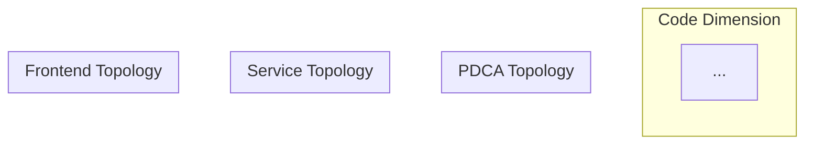

# STORY-slim-048: Unified Layered Graph

| Field | Value |
|-------|-------|
| ID | STORY-slim-048 |
| Status | Draft |
| Priority | P3 — Impact 4, Effort 4 |
| Release | 2.5.0 |

## Background

By the time this story is implemented, PactKit will have three independent analysis dimensions:
1. **Code dimension**: function→function call graph (`call_graph.mmd`) from tree-sitter
2. **Logic dimension**: topology-specific workflow graph (`workflow_graph.mmd`) from TopologyParsers
3. **Multiple topologies**: PDCA, Service, Frontend — each producing separate WorkflowGraphs

This story merges all dimensions into a single layered dependency graph, enabling cross-dimension impact analysis: "I changed function `createOrder()` → it affects `order-service` (code→service) → which affects `payment-service` (service→service) → whose `/checkout` page breaks (service→frontend)."

## Requirements

### R1: Unified graph model (MUST)

A `build_unified_graph(root)` function MUST produce a single `WorkflowGraph` containing nodes and edges from ALL active dimensions:
- Code dimension: function/class nodes from call_graph
- Logic dimension: all topology-specific nodes (command/service/page/etc.)
- Cross-dimension bridge edges connecting them

### R2: Cross-dimension bridge edges (MUST)

The unified graph MUST contain bridge edges linking code-level entities to logic-level entities:
- `function` node → `service` node (when function belongs to a service's source code)
- `function` node → `skill` node (when function is defined in a skill script)
- `component` node → `function` node (when a React component calls a utility function)

### R3: Layered Mermaid output (MUST)

`to_mermaid()` MUST render the unified graph with subgraphs organized by dimension:


### R4: Cross-dimension impact analysis (MUST)

`workflow_impact(root, entry=<any_node>)` MUST traverse across dimensions. Changing a function that belongs to a service MUST surface both code-level callers AND service-level dependents.

### R5: Performance constraint (MUST)

A new constant `MAX_WORKFLOW_NODES = 500` MUST be defined in `visualize.py` (alongside existing `MAX_SCAN_FILES`). The unified graph MUST enforce this limit. If total nodes across all dimensions exceed this limit, the graph MUST be truncated with a warning.

## Acceptance Criteria

### AC1: Unified graph contains all dimensions (R1)

- **Given** a project with code graph, PDCA topology, and service topology
- **When** calling `build_unified_graph(root)`
- **Then** the graph contains nodes from all three sources

### AC2: Bridge edges connect dimensions (R2)

- **Given** a function `archive()` in `board.py` that belongs to skill `pactkit-board`
- **When** building the unified graph
- **Then** a bridge edge exists: `board.py:archive → pactkit-board`

### AC3: Layered Mermaid rendering (R3)

- **Given** a unified graph with nodes from multiple dimensions
- **When** calling `to_mermaid()`
- **Then** output contains separate subgraph sections for each dimension/topology

### AC4: Cross-dimension impact (R4)

- **Given** a unified graph where function `createOrder()` is in `order-service`, which is called by `payment-service`
- **When** calling `reverse_reach("createOrder")`
- **Then** result includes both code-level callers AND `payment-service`

### AC5: Node limit enforced (R5)

- **Given** a large project where total nodes across all dimensions = 600
- **When** building the unified graph
- **Then** the graph is truncated to 500 nodes with a warning message

## Target Call Chain

```
build_unified_graph(root)
  → build_workflow_graph(root)              # all TopologyParsers
  → _load_code_graph(root)                  # reuse tree-sitter/LanguageAnalyzer pipeline
  → _build_bridge_edges(code_graph, workflow_graph)  # cross-dimension links
  → merge all into single WorkflowGraph
  → enforce MAX_WORKFLOW_NODES
  → return unified_graph
```

## Implementation Steps

| Step | File | Action | Dependencies | Risk |
|------|------|--------|-------------|------|
| 1 | `tests/unit/test_story_slim048.py` | TDD: tests for unified graph construction and bridge edges | STORY-slim-042, 045 | Low |
| 2 | `src/pactkit/skills/visualize.py` | Implement `_load_code_graph()` — reuse existing tree-sitter/LanguageAnalyzer pipeline to build function-level WorkflowGraph (not parse mmd text) | None | Medium |
| 3 | `src/pactkit/skills/visualize.py` | Implement `_build_bridge_edges()` — heuristic matching | Step 2 | High |
| 4 | `src/pactkit/skills/visualize.py` | Implement `build_unified_graph()` orchestrator | Steps 2-3 | Medium |
| 5 | `src/pactkit/skills/visualize.py` | Extend `to_mermaid()` for layered subgraphs | Step 4 | Medium |

## Security Scope

| Check | Applicable | Reason |
|-------|------------|--------|
| SEC-1 Input validation | Low | Reads local mmd files and existing graph data |
| SEC-2 through SEC-7 | N/A | No auth, crypto, injection, or network changes |
| SEC-8 Dependencies | N/A | No new dependencies |

## Out of Scope

- Real-time graph updates (watch mode)
- Interactive graph exploration (web UI)
- Graph diff between commits
- Performance profiling integration
- CI/CD pipeline topology
